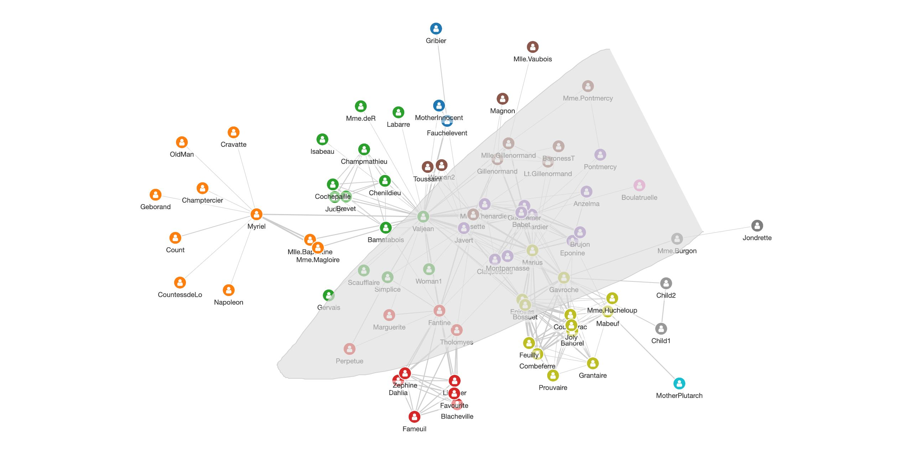

# cytoscape-lasso

[](https://www.npmjs.com/package/cytoscape-lasso)
[](https://www.npmjs.com/package/cytoscape-lasso)
[](https://www.npmjs.com/package/cytoscape-lasso)

Lasso selection plugin for Cytoscape

[Demo](https://zakjan.github.io/cytoscape-lasso/)



Lasso selection is implemented using public Cytoscape API, rendering lasso polygon to a new topmost separate canvas.

Lasso polygon style can be controlled by box selection [style properties](https://js.cytoscape.org/#style/core):

- `selection-box-color`
- `selection-box-border-color`
- `selection-box-border-width`
- `selection-box-opacity`

Box selection [core events](https://js.cytoscape.org/#events/user-input-device-events) and [collection events](https://js.cytoscape.org/#events/collection-events) are fired:

- `boxstart`
- `boxend`
- `boxselect`
- `box`
- `select`
- `unselect`

## Install

```
npm install cytoscape-lasso
```

or

```
<script src="https://unpkg.com/cytoscape-lasso@1.1.1/dist/cytoscape-lasso.min.js"></script>
```

## Usage

The plugin exposes a single function, which should be used to register the plugin to Cytoscape.js.

```
import cytoscape from 'cytoscape';
import cytoscapeLasso from 'cytoscape-lasso';

cytoscape.use(cytoscapeLasso);
```

Plain HTML/JS has the extension registered for you automatically.

### API

```
cy.lassoSelectionEnabled()
cy.lassoSelectionEnabled(bool)
```

Get or set whether lasso selection is enabled. If enabled along with panning, the user must hold down one of shift, control, <!--alt, -->or command to initiate lasso selection.

## Sponsors

<a href="https://graphlytic.biz/"></a>

[Graphlytic](https://graphlytic.biz/) is a customizable web application for collaborative graph visualization and analysis. There is a [free version for Neo4j Desktop](https://graphlytic.biz/blog/how-to-install-graphlytic-in-neo4j-desktop) available.